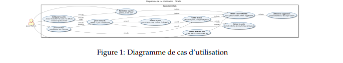
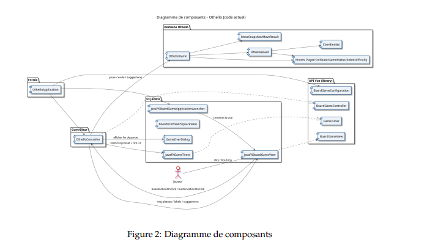

# Othello - Java / JavaFX

Desktop Othello (Reversi) game in Java with a JavaFX UI. The code cleanly separates domain logic, controller, and view (MVC), and includes player vs player plus two AI levels.

## Visuals

### Game UI


### Use Cases


### Architecture / Components


## Features
- PVP and player vs AI (Easy and Hard) selectable from the UI.
- Strict move validation, 8-direction flipping, and valid move suggestions.
- Game timer, live score, and current turn display.
- Undo (1 move in PVP, 2 moves in AI) and full reset.
- Game over screen with result, score, move count, elapsed time, and mode.

## Technical Analysis

### Domain Logic
- `OthelloBoard` manages the 8x8 grid, move validation, and piece flipping.
- `OthelloGame` orchestrates game state, undo history, and end-game detection.
- `MoveSnapshot` stores board snapshots and elapsed time for undo.
- `GameStatus` handles `IN_PROGRESS`, `FINISHED`, `DRAW`, including turn passing when no moves are available.

### Controller and UI
- `OthelloController` wires UI events to domain actions and refreshes board and labels.
- Visual hints use `Shape.SUGGESTION` and are cleared via `clearSuggestions`.
- AI mode adds a 1-second delay and highlights the last robot move in red.
- `GameOverDialog` shows final stats (mode, scores, moves, time).

### AI
- Easy: random valid move.
- Hard: choose the move that flips the most pieces (simple, effective heuristic).

## Tests and Quality
- JUnit 5 test suite for move validation, flipping logic, status transitions, AI, and controller behavior.
- JaCoCo coverage report for regression safety.

## Tech Stack
- Java (toolchain 25 in `build.gradle`)
- JavaFX 25 (OpenJFX plugin)
- Gradle + ShadowJar
- JUnit 5, JaCoCo

## Run the Project

### Prerequisites
Check your Java version:
```bash
java -version
```
The project uses a Java 25 toolchain. Adjust `build.gradle` if needed.

### Run
```bash
./gradlew run
```

### Tests
```bash
./gradlew test
```

### Coverage
```bash
./gradlew jacocoTestReport
```

## Repository Structure
- `src/main/java/fr/univ_amu/m1info/othello` game logic, controller, UI
- `src/main/java/fr/univ_amu/m1info/board_game_library` JavaFX UI library
- `src/test/java/fr/univ_amu/m1info/othello` unit and integration tests
- `docs/images` screenshots and diagrams
